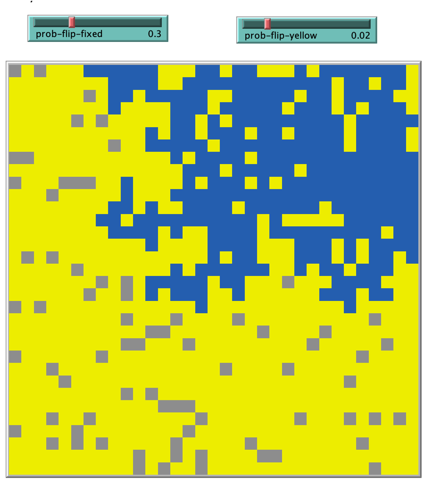

# The Door Colour Imitation Models
This set of three models capture the *dynamics of imitation*, where neighbours can copy each other, and change their colour.

Think of a neighbourhood where we want to model how door colours change, and we think we have found a way to model this. 

The theory underlying this is persuasive, as in marketing the [*word of mouth effect*](https://en.wikipedia.org/wiki/Word-of-mouth_marketing) is often cited as reasons why product sales "take off". For example, we might say that a new product has "gone viral".

Here are quick links to the NetLogo models:

1. [Door imitation model 1](https://github.com/JimDuggan/EPE/blob/main/ABM/01%20Doors/AgentsPropRule.nlogo)
2. [Door imitation model 2](https://github.com/JimDuggan/EPE/blob/main/ABM/01%20Doors/AgentsRFRule.nlogo)
3. [Door imitation model 3](https://github.com/JimDuggan/EPE/blob/main/ABM/01%20Doors/AgentsRFRuleThree.nlogo)

## Model 1: Door imitiation using a proportional rule

### 1.1 Overview
Our [first model](https://github.com/JimDuggan/EPE/blob/main/ABM/01%20Doors/AgentsPropRule.nlogo)  has the following appearance when opened in NetLogo.

<p align="center" width="100%">
    
</p>

There are a number of important elements:

* The square on the left is a visualisation of NetLogo's patch structure. When you press the **setup** button, all patches will be initialised.

* In this model, there are 1089 patches (or cells), as the coordinates of our *patch world* go from -16 to 16 in x and y directions (33x33), with patch (0,0) at the centre.

* This means we are modelling 1089 dwellings in a grid-type neighbourhood. Each dwelling (patch) has a colour. We are proposing that the colour blue (for dwelling doors) has the potential to *go viral*.
 
* The two buttons allow you to run the code. "setup" initialises the model, and "go" runs the model.

* Below the two buttons we have our plots. This will show the numbers of doors that are gray and blue as the simulation proceeds.

* The "Command Center" allows you to directly interact with NetLogo. For example, try typing the following code:

```
ask one-of patches [set pcolor red]
```

The idea here is:

* **ask** is used to communicate with an agent
* **one-of patches** will select one patch agent at random
* The code between the square brackets is what the agent executes. It will set its patch colour to red.


You should see a red square appear in a random location.

### 1.2 Model Design

In designing agent-based models, it is useful to sketch what kind of "states" you think the agent might have, and how these can be related to one another.

For example, in our first model, there are two states: an agent (i.e. a NetLogo **patch**) is coloured either gray or blue.

* If they are gray, they may switch to blue, depending on their neighbour's colour.

* If they are blue, they remain blue.

We show this in a **state transition chart**, and notice the direction of the arrow. That confirms that we can move from gray to blue, but not vice-versa.

<p align="center" width="100%">
    
</p>

As this diagram shows, the chance of transitioning (i.e. the probability) is the proportion of blue neighbours in an agent's neighbourhood.

For simplicity, we assume a four-neighbour patch model, therefore influential neighbours are located north, south, east, and west of a patch.

A "flip" scenario is shown below for the centre gray patch.

<p align="center" width="100%">
    
</p>

Here is the decision logic for the centre patch:

* It searches its environment to calculate the number of patches that are blue. This is a simple model of an agent "looking out their window"" and counting the number of blue doors in their immediate neighbourhood.

* It then transforms this number to a proportion.

* A random number between 0 and 1 is then generated. For example, let's say the number 0.24 is generated.

* If this (0.24) is less than the proportion (0.25), the patch will flip to blue.

And this is the essence of our agent-based model. 

We could program this is many languages, but here we will use NetLogo, because it is specifically designed to help you develop agent-based models.

### 1.3 Coding Model 1 in NetLogo
To implement this in NetLogo, we have coded the following elements

#### setup procedure
All models need a **to setup** procedure to set the initial conditions for the model. Here is the setup code for this model.

```
to setup
  clear-all
  ask patches [set pcolor gray]
  ask one-of patches [set pcolor blue]
  set total-gray count patches with [pcolor = gray]
  set total-blue count patches with [pcolor = blue]
  reset-ticks
end
```

This is what happens when **to setup** is called:

* All previous values of patches (and global variables) are cleared with the [clear-all](https://ccl.northwestern.edu/netlogo/docs/dict/clear-all.html) command.

* We ask all patches to set their colour to gray

* Using the command [one-of](https://ccl.northwestern.edu/netlogo/docs/dict/one-of.html), NetLogo will select a random patch and set its colour to blue.

* The global variables **total-gray** and **total-blue** are initialised.

* The clock is reset using [reset-ticks](https://ccl.northwestern.edu/netlogo/docs/dict/reset-ticks.html#:~:text=reset%2Dticks4.0&text=Resets%20the%20tick%20counter%20to,end%20of%20a%20setup%20procedure)

#### to go procedure
All NetLogo models need a **to go** [procedure](https://sesync-ci.github.io/netlogo-programming-lesson/index.html#:~:text=NetLogo%20Procedures,-Thus%20far%2C%20we&text=The%20way%20to%20make%20patches,new%20command%20that%20you%20define.), which will be repeatedly called by NetLogo. It captures the logic of the simulation, and the order in which instructions should be carried out. Order is important, for example, think of following a recipe when cooking: to get the desired output the correct sequence must be followed.

For example, if you're cooking a pizza, you place the sauce on the base before adding the toppings. It's the same idea in coding. 

Here is the code for **to go**

```
to go
  if count gray-houses = 0 [stop]
  ask gray-houses [
    flip-to-blue
  ]
  update-plots
  tick
end
```

So, this is what is going on:

* We check to see if the number of gray houses is 0 using NetLogo's **count** command, which reports the number of agents in an agentset. If it is, we stop the simulation. This is called a *halting condition*, and it uses NetLogo's [*if statement*](https://ccl.northwestern.edu/netlogo/bind/primitive/if.html)

* We then call a NetLogo [reporter](https://ccl.northwestern.edu/netlogo/bind/primitive/to-report.html#:~:text=A%20reporter%20is%20a%20predefined,write%20ticks%20in%20the%20code.) we've written called *gray-houses*. This will return a list of all patches that are gray. We then ask each gray patch to call the procedure *flip-to-blue*. In any model, we can write our own reporters and procedures. They are quite similar, except that a reporter returns some information we can use. 

* We then call the NetLogo procedure **update-plots** which will update the plots on our user interface.

* The command **tick** will update the clock, and then the procedure ends.

#### to-report gray-houses procedure
Now we move on to the procedure **to-report gray-houses**, which has the following code. Note that a reporter is designed to return some information, and is very useful to perform what sometimes known as a  *divide and conquer* approach on your NetLogo model. The *divide and conquer* idea means that we try to break problems down into smaller units (e.g. reporters and procedures). This makes the code easier to understand and maintain.

```
to-report gray-houses
  report patches with [pcolor = gray]
end
```

Here are the main elements of this reporter procedure:

* The keyword **to-report** is needed, followed by a name you decide to call it (in this case, gray-houses)

* The **report** keyword returns whatever code (or variable) follows. Here the code only selects those patches with a patch colour of gray.

* This is useful, as anytime we want to get a list of all the gray patches, we just call **gray-houses**

Looking back to the **to go** procedure, we see the following line of code where we call the procedure *flip-to-blue* for each patch that is gray.

The keyword [**ask**](https://ccl.northwestern.edu/netlogo/docs/dict/ask.html) is a way of getting agents to do something.

```
  ask gray-houses [
    flip-to-blue
  ]
```

We now describe the procedure **flip-to-blue**, which implements our switching logic.


#### to flip-to-blue procedure
This procedure is called for every agent whose patch colour is gray. Here is the code.

```
to flip-to-blue
  let n-prop-blue count neighbors4 with [pcolor = blue] /
                  count neighbors4
                  
  let flip-prob random-float 1
  
  if flip-prob < n-prop-blue
      [
        set pcolor blue
        set rec-flip-prob flip-prob
        set rec-n-prop-blue n-prop-blue
        set total-blue total-blue + 1
        set total-gray total-gray - 1
      ]
end
```

Here are the main elements of this procedure, which really just codes the idea shown in the earlier diagram *Model 1 - a "flip" scenario*. 

* Store the proportion blue in the variable **n-prop-blue**. The NetLogo [primitive](https://ccl.northwestern.edu/netlogo/bind/article/what-is-a-primitive.html#:~:text=Primitives%20are%20the%20building%20blocks,construct%20complex%20agent%2Dbased%20models.) named [neighbors4](https://ccl.northwestern.edu/netlogo/bind/primitive/neighbors4.html) is used to count (1) the number of blue neighbours and (2) the total number of neighbours.

* Generate a random number from the range [0,1] using the primitive [random-float](https://ccl.northwestern.edu/netlogo/bind/primitive/random-float.html), and store in the variable **flip-prob**.

* Check to see if **flip-prob** is less than **n-prop-blue**. If this is true, then it's "game on", and the flipping process is activated with the following steps, written inside the square brackets.
  1. Set the patch colour to blue
  2. Record two patch values **rec-flip-prob** and **rec-n-prop-blue**, which are defined using the [**patches-own**](https://ccl.northwestern.edu/netlogo/docs/dict/patches-own.html) command. We record these so they can be check later to make sure that the logic is working ok.
  3. Increment the global variable **total-blue** by one. This variable will be plotted in the user interface.
  4. Decrement the global variable **total-gray** by one. This variable will also be plotted in the user interface.

That concludes the main coding logic, all that remains now it to define the global and patch variables. Note that in the code, these are usually defined at the top of the code file.

#### global and patch variables
As the simulation progresses, we want to communicate and record information, and we can do this using **global variables** and **patch variables**.

Here is the code we use.

```
patches-own [rec-flip-prob rec-n-prop-blue]
globals [total-gray total-blue]
```

These are valuable commands:

* [patches-own](https://ccl.northwestern.edu/netlogo/docs/dict/patches-own.html) allows you to associate variables to store extra information for each patch. Here we store information on the flip conditions for each patch agent.
* [globals](https://ccl.northwestern.edu/netlogo/bind/primitive/globals.html) is a primitive that allows you to define global variables within your simulation. In this code, we have one global variable to store the total number of patches that are gray and blue.


### 1.4 Summary
We have now presented the model design and implementation. All that remains now is to run the model using NetLogo. A number of pointers for this:

* Set the tick speed to slower so that you can see more clearly how the patches are changing colour
* Press "setup" to setup the simulation
* Press "go" to run the simulation
* **Are there any changes you can make to stop the blues from being the sole colour?** [Hint: what if you set a random number of patches to a colour that's not gray or blue], for example:

```
ask n-of 100 patches [set pcolor green]
```

Once the simulation is finished, you can explore the model values using the command center. 

Try the following commands:

```
show count patches
show total-gray
ask one-of patches [show pxcor show pycor show rec-flip-prob show rec-n-prop-blue]
ask patch 0 0 [show pxcor show pycor show rec-flip-prob show rec-n-prop-blue]
ask patch 0 0 [set pcolor red]
ask patch 0 0 [ask neighbors4 [show pxcor show pycor]]
```

When you are finished with this exercise, try a new formulation of the flip logic in Model 2.

## 2. Model 2: Door imitiation using the Reed-Frost equation

### 2.1 Overview
Our [second model](https://github.com/JimDuggan/EPE/blob/main/ABM/01%20Doors/AgentsRFRule.nlogo) contains one significant change from the first model, and that relates to the transition change. Instead of using the proportion as a probability, we will use the relevant [Reed-Frost](https://en.wikipedia.org/wiki/Reed–Frost_model) equation from epidemiology, which estimates the probability (risk) of changing as:

$\lambda = 1 - (1 - p)^N$

Where:

* $\lambda$ is the risk of getting infected
* $p$ is the probability of getting infected when encountering an infectious person
* $N$ is the number of infected people.

We can use this equation to model the probability of changing from gray to blue, as follows:

$\lambda = 1 - (1 - p)^{NB}$

Where:

* $NB$ is the number of blue neighbours
* $p$ is the probability of a gray neighbour changing to blue when they interact/see a blue neighbour.

Note in the case where $NB$=0, the value of $\lambda$ is 0, and therefore they probability is zero (therefore change cannot happen).


### 2.2 Model Design

The new **state transition chart** is shown below, and the only difference is that $\lambda$ is used instead of the neighbours proportion.

<p align="center" width="100%">
    
</p>

An updated "flip" scenario is shown below for the centre gray patch.

<p align="center" width="100%">
    
</p>

Here is the decision logic for the centre patch:

* It counts the number of blue doors in their immediate neighbourhood.

* With a fixed value of $p$, it calculates $\lambda$ using the Reed-Frost equation.

* A random number between 0 and 1 is then generated. For example, let's say the number 0.14 is generated.

* As this is less that $\lambda$ the patch will flip to blue.

The interface for this new model is shown below, and we can see a new parameter is added, **prob-fixed-flip**, which sets the value of $p$.

<p align="center" width="100%">
    
</p>


We now present the changes to the original code to accomodate the Reed-Frost equation.

### 2.3 Coding Model 2 in NetLogo
To implement this in NetLogo, we have coded the following elements

#### setup procedure
There is no change to this procedure from the first model

#### to go procedure
There is no change to this procedure from the first model

#### to-report gray-houses procedure
There is no change to this procedure from the first model

#### to flip-to-blue procedure
Because we now use a new mechanism for the flip process, the **flip-to-blue** procedure is changed. Here is the new code.

```
to flip-to-blue
  let number-blue count neighbors4 with [pcolor = blue]

  let flip-prob 1 - (1 - prob-flip-fixed) ^ number-blue

  let rn random-float 1

  if rn < flip-prob
      [
        set pcolor blue
        set rec-num-blue number-blue
        set lambda flip-prob
        set rand-no rn
        set total-blue total-blue + 1
        set total-gray total-gray - 1
      ]
end
```

Here are the main elements of this revised procedure, which really just codes the idea shown in the earlier diagram *Model 2 - a "flip" scenario*. 

* We count the number of neighbours who are blue

* We calculate lambda (flip-prob) based on the **prob-flip-fixed** and **number-blue**

* After generating a random number between [0,1], if this is less than flip-prob we:
  1. Set the patch colour to blue
  2. Record **patch-own** variables for **number-blue**, **flip-prob**, **rn**
  3. Update global values for **total-blue** and **total-gray**

#### global and patch variables
The following global and patch variables are declared.

```
patches-own [rec-num-blue lambda rand-no]
globals [total-gray total-blue]
```

### 2.4 Summary

Here are some steps you could take:

* Experiment with the value of $P$ (*prob-flip-fixed*) to see how it impacts spread. For example, should setting it to zero result in no new blue patches? If so, why?

* **Think about the logic of Reed-Frost, can you see how it might have been formulated?** Hint: if you have one blue neighbour then the probability of not switching is $1-p$.

## 3. Model 3: Extending Model 2 with Yellow Doors

### 3.1 Overview

For our [third model](https://github.com/JimDuggan/EPE/blob/main/ABM/01%20Doors/AgentsRFRuleThree.nlogo) we now add a third possible colour - yellow. Gray doors can now also switch to yellow, but yellow cannot switch to blue. Therefore yellow status can be seen as a "stubborn" choice, where a patch "locks into" a door colour and will not change.

The goal here is to observe the competition between blue and yellow for gray patches. The user interface for this model is shown below, and we will present the logic in more detail in the next sections.

<p align="center" width="100%">
    
</p>


### 3.2 Model Design

The new **state transition chart** is shown below. 

<p align="center" width="100%">
    
</p>

There are a number of points worth noting:

* A door/patch can now be in three "states": gray, blue, and yellow.

* The colours blue and yellow are "end states", once there, there is no escape for the agent/patch!

* The probability of gray moving to blue is the same as before ($\lambda$)

* The probability of gray moving to yellow is fixed, and determined by the user.

A scenario for the transition from gray to yellow is shown in the following chart, assuming the random number generated is 0.006 (less that 0.01). When running the model, you can experiment with different values.

<p align="center" width="100%">
    
</p>

### 3.3 Coding Model 3 in NetLogo
To implement this in NetLogo, we have coded the following elements. 

Because there are more changes in this model, we will describe all of the code.

#### setup procedure
This is the code for the setup procedure.

```
to setup
  clear-all
  ask patches [set pcolor gray]
  ask one-of patches [set pcolor blue]
  set total-gray count patches with [pcolor = gray]
  set total-blue count patches with [pcolor = blue]
  set total-yellow 0 
  reset-ticks
end
```

This is similar to the previous code: all patches are set to gray, and then we randomly select one of these to be blue. The global counters are also initialised.

#### to go procedure
We now describe the **main loop** of the model.
```
to go
  if ticks >= 100 [stop]

  ask gray-houses [
    flip-to-blue
  ]

  ask gray-houses [
    flip-to-yellow
  ]

  update-plots
  tick
end
```

The main change here is that we now ask gray houses to **flip-to-yellow**, and this is (arbitrarily) performed after we ask house to **flip-to-blue**. 

**Does the order make a difference?** 

Possibly, and that is something you could explore through experimentation.


#### to-report gray-houses procedure
This reporter (again a reporter is a special procedure that returns information) returns a list of all gray coloured patches/agents.

```
to-report gray-houses
  report patches with [pcolor = gray]
end
```


#### to flip-to-blue procedure
This code is the same as Model 2, it uses our Reed-Frost equation to determine the probability of changing from gray to blue.

```
to flip-to-blue
  let number-blue count neighbors4 with [pcolor = blue]

  let flip-prob 1 - (1 - prob-flip-fixed) ^ number-blue

  let rn random-float 1

  if rn < flip-prob
      [
        set pcolor blue
        set rec-num-blue number-blue
        set lambda flip-prob
        set rand-no rn
        set total-blue total-blue + 1
        set total-gray total-gray - 1
      ]
end
```

#### to flip-to-yellow procedure
This is a new procedure, where each patch is asked to flip-to-yellow. Depending on the random number generated, this may happen.

```
to flip-to-yellow

  let rn random-float 1

  if rn < prob-flip-yellow
      [
        set pcolor yellow
        set total-yellow total-yellow + 1
        set total-gray total-gray - 1
        set rand-no-yellow rn
        set prob-flip-to-yellow prob-flip-yellow
      ]
end
```

Here is the procedure's logic:

* A random number between [0,1] is created

* If this is less than the fixed probaility (**prob-flip-yellow**), then the gray patch will flip to yellow.

* If a flip happens, then a number of actions occur:
  1. The patch colour is set to yellow
  2. The counters for yellow (increment) and gray (decrement) are changed
  3. The patch variables are recorded (**rand-no-yellow** and **prob-flip-to-yellow**)

#### global and patch variables
Here are the global and patch variables defined for the model.

```
patches-own [rec-num-blue lambda rand-no rand-no-yellow prob-flip-to-yellow]
globals [total-gray total-blue total-yellow]
```
One new accumulator variable is added, **total-yellow**. 

The **patches-own** variables are arbitrary, and here we store values relating to the two possible switching processes.

Here is sample output from a simulation run.

<p align="center" width="100%">
    
</p>

Note that the blues did not get to dominate, and that - in the available time - not all grays changed state. However, if you ran the model long enough, eventually all the remaining grays would change to yellow or blue, depending on their neighbourhood structure. 

**Can you explain why this will be the case?**


### 3.4 Summary
Some overall points on this model.

* Each grey square has the potential to change to either blue or yellow.

* For changes to blue, this probability is governed by (a) the number of blue neighbours and (b) the probability of flipping to blue.

* For changes to yellow, this probability is only governed by the probability of flipping to yellow. 

* Note that all colour changes in the models are **random processes**, but as we repeat these actions, the outcome is more likely to occur. For example when you throw a dice 10 times, you would expect to get close enough to 10 sixes. So even though the probability could be low, when we repeat the code many many times, the chance of somethijg occuring is more likely.

* The random nature of the changes means that we often need to run simulations many times to get an average behaviour. For example, two successive runs (with the same inputs) could result in very different values for the numbers converting to blue and yellow. This is a feature of agent-based modelling, and the technical word often used to describe this is **stochastic**.


Reflection

**Is there any real world example that might use a similar logic?**

Hint: think of an example from public health, for example, an infectious pathogen. This can be spread by our neighbours through contacts. We will explore this type of model in our next set of examples.


## 4. Overall Summary
You have now explore three related agent-based models. There are two aspects to these models:

1. The NetLogo commands, including procedures, reporters, and primitives. It takes time to become familiar with these, but a great way to check things out is to type the command in the **Command Center** and see how patches change.

2. The switching logic. There is a pattern here for the switches. 
  * First we can model the transitions with a **state transition diagram** showing the models potential, and adding the probability for each transition.
  * Then (if needed) we calculate the probabilities. The ones that were not fixed were the transition from gray to blue, and we used two methods for this (proportion of neighbours blue, and Reed-Frost)
  * Once the probability is know, the approach for deciding on a transition is similar. We "flip a coin" to get a number between 0 and 1, and then flip state if that random number is less than the probability.
  


